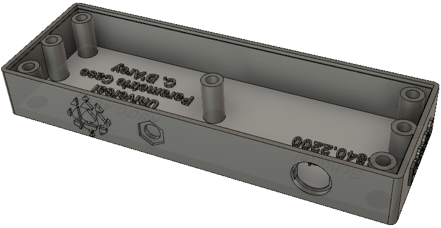

# ACESFusion360DesignFiles
**Partial Archive of ACES Fusion 360 Project Design Files**

# Universal Parametric Case
**Files**
- ACESUniversalCase/ACESUniversalParametricCase.f3d
- ACESUniversalCase/ACESUniversalParametricCaseParamtersCase.csv

# Grade 11
## Perma Proto Cases and Holders

### Case: Full Size Perma Proto
**File: FullSizePPCase v3.f3d**

### Case: Half Size Perma Proto
**File: HalfSizefromACESUniversal.f3d**

### Holder: Full Size Perma Proto (Insets)
**File: FullSizeHolder v7.f3d**

### Case: Half Size Perma Proto Mint Tin
**File: ACESMintTinPCBCase.f3d**

### Holder: Perma Proto (Thingiverse Variants)

### Holder: Half Size Perma Proto (Thingiverse)

### Holder: Half Size Perma Proto (Insets)
**File: HalfSizeHolderforDESPrinting.f3d**

### Holder: Half Size Perma Proto (Nut Pockets)

## Bargraph Holders
**Files**
- BargraphHolders/BargraphHolder Updated 12 pin.f3d
- BargraphHolders/BargraphHolder Updated 12 pin.stl
- BargraphHolders/BargraphHolder Updated 8 pin.f3d
- BargraphHolders/BargraphHolder Updated 8 pin.stl

# Grade 12
## Dolgin Development Case
**File: DDBCaseSA23.f3d**

# Grade 10
## LED Tester
**File: MyLEDTesterCase/MyLEDTesterCase.f3d**

## Universal Grade 10 Case
**File: AnalogOscillatorCasePlasticPowerJackFinal.f3d**

## Grade 10 Counting Circuit Case
**File: ICD2OCountingCircuitCase.f3d**

