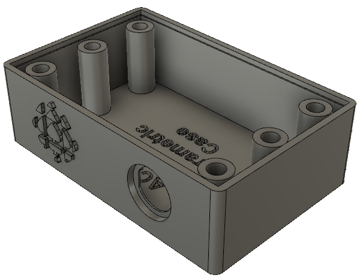
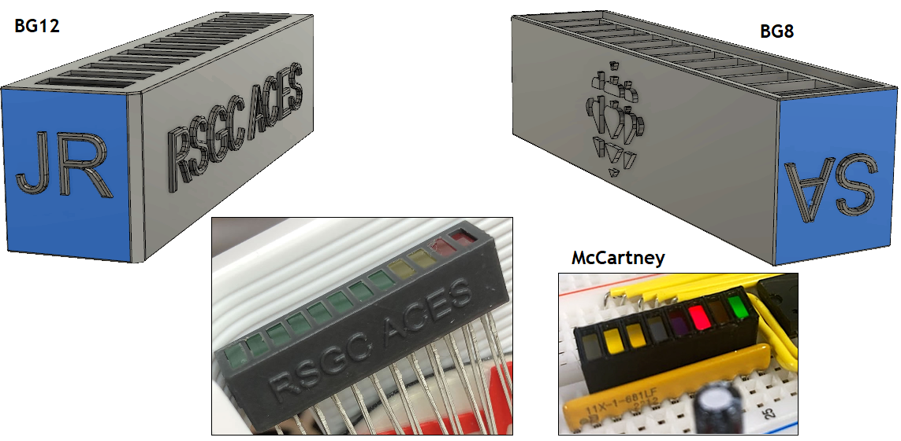

# ACESFusion360DesignFiles
 Partial Archive of ACES Fusion 360 Project Design Files

#Universal Parametric Case

# Grade 11
## Perma Proto Cases and Holders

### Case: Full Size Perma Proto

### Case: Half Size Perma Proto

### Case: Half Size Perma Proto Mint Tin

### Holder: Half Size Perma Proto (Insets)

### Holder: Half Size Perma Proto (Nut Pockets)

### Holder: Half Size Perma Proto (Thingiverse)

## Bargraph Holders

# Grade 12
## Dolgin Development Case

# Grade 10
## LED Tester

## Universal Grade 10 Case

## Grade 10 Counting Circuit Case

